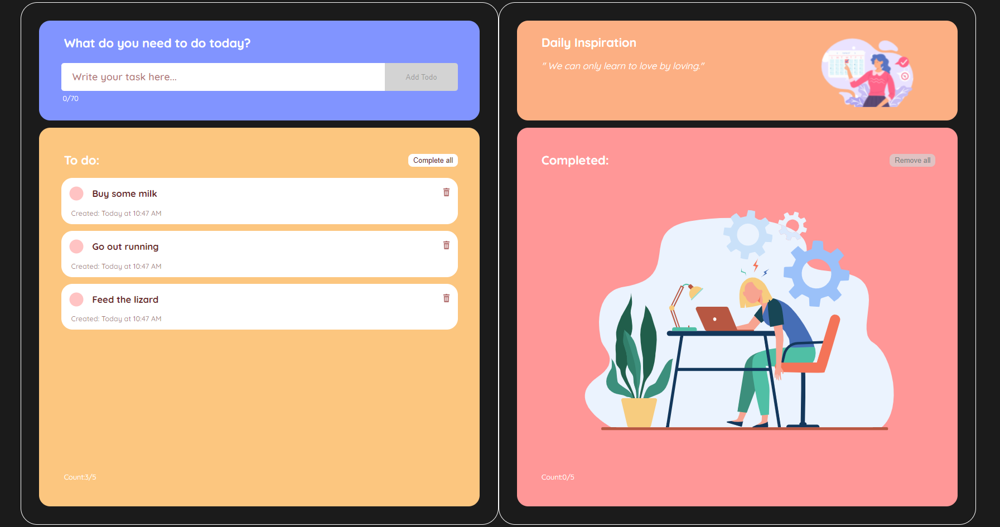

<h1 align="center">
  
</h1>

# Todo - useContext Project

During this project we were assigned the task of making a Todo list where the user can add custom tasks, mark them as complete, delete them or reverse them to uncompleted. We were supposed to use useContext for global state. 

# The Problem
- Design: We were not given any design templates and we built the design from scratch.
- useContext: We created 2 custom contexts for todo and complete tasks separately in order to manipulate their state independently.
- useSound: We implemented the useSound hook by which we can insert and play audio files triggered by user actions.
- moment.js: We applied the moment.js module that generates the created date. We saved the raw moment in the state and display the formatted time.
- API call and useEffect: We created a section for displaying daily inspiration quote fetched by API call and triggered by the useEffect hook.

If we had more time, we would like to challenge ourself with the streach goal - implementing the due date and categories.

# View it live
https://todo-weniza.netlify.app
