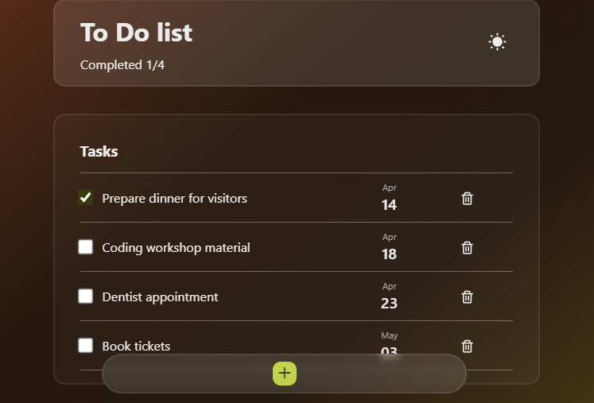

<h1 align="center">
  
</h1>

# Todo - useContext Project

A simple To-Do List App allows users to manage their tasks efficiently. Users can add tasks with descriptions, mark tasks as complete, remove tasks, and toggle between light and dark themes.

Key Features:

- Add Tasks: Users can add tasks to their to-do list by entering a task description.
- Mark Tasks as Complete: Users can mark tasks as complete by clicking a checkbox next to each task.
- Remove Tasks: Users can remove tasks from their to-do list by clicking a delete button.
- Themes: Users can toggle between light and dark themes to customize their app experience.
- Persistent Storage: Tasks are stored in the browser's localStorage, ensuring that tasks are saved between sessions.

UI designer inspired by:
https://dribbble.com/shots/20064912-Task-Note-App-Reminders-App-Design-To-do-App
https://dribbble.com/shots/20053307-Brutal-List-To-Do-Mobile-App

### View it live

